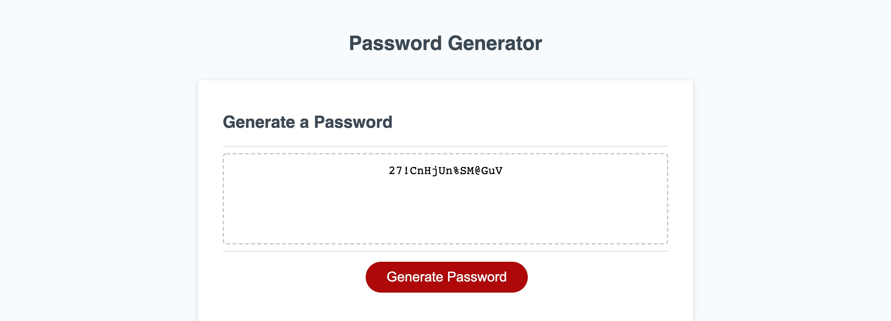

# Challenge #3 - Password Generator

## Description

    This project was about using basic JavaScript fundamentals (for loops, if/else statements, creating functions, etc.) to create a password generator. This program randomly concatenates a password from 4 different types of characters (lowercase, uppercase, special characters, and numbers), but randomizes the order. It also takes the users input for which chararcter type they would like to add into their password.

## Experience Gained

    This challenge was the toughest so far, as it forced me to really think about how to write functions that can intertwine with one another. Once I had written the inital chunk of code to get the program to produce a password, then I reviewed what I had typed and refactored small pieces at a time. Thankfully, doing this allowed me to find the bug that would produce 'undefined' in the password - the randomizing function would pull beyond the index parameter of the arrays, albeit inconsistently. I learned much about debugging through this process and used if/else statments to catch errors from user input afterwards.

## GitHub Links (Deployed Site and Repository)

    The project deployment can be seen at: https://ekball.github.io/C3-Password-Generator/

    The repository link: https://github.com/ekball/C3-Password-Generator

## Deployed Site Screenshot

